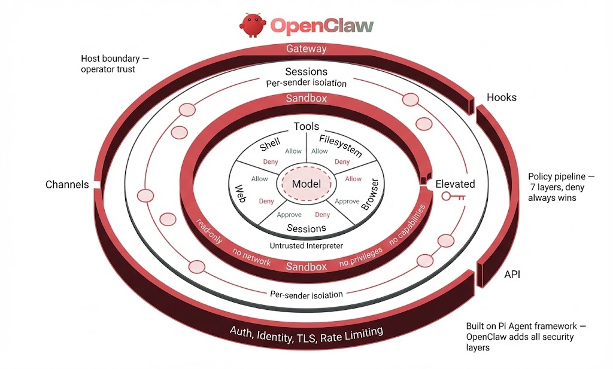

# OpenClaw Goto Spec



OpenClaw's security model is a series of concentric rings. Every request, regardless of origin, enters through the **gateway** -- the outermost ring. The gateway enforces authentication (token, password, or trusted-proxy modes), verifies device identity via Ed25519 challenge-response, requires TLS 1.3 as a minimum, and applies rate limiting. Entry points include messaging channels (WhatsApp, Telegram, Discord, Slack), webhook hooks (authenticated with a separate bearer token), and the direct API. If authentication fails at the gateway, no inner ring is reached. Nothing else runs.

Once past the gateway, each sender is assigned an isolated **session**. Sessions provide per-sender conversation context so that one user's state never bleeds into another's. Session keys function as routing keys, not as auth boundaries -- the gateway has already established identity. DM policies (pairing, allowlist, disabled) and group policies (allowlist, requireMention, disabled) determine which senders are permitted to interact at all. A sender who does not satisfy the channel policy is dropped before reaching any tool or model.

Inside the session boundary sits the **sandbox** -- a Docker container that isolates agent execution from the host. Unconditional hardening is applied to every container: read-only root filesystem, no network access, all Linux capabilities dropped, and no-new-privileges. On top of that base, operators configure the sandbox mode (off, non-main, or all agents), container scope (per-session, per-agent, or shared), and workspace access level (none, read-only, or read-write). Elevated mode is the controlled escape hatch that allows host execution, gated by per-provider allowFrom lists that restrict which senders can activate it.

At the innermost ring are the **tools** themselves, governed by a 7-layer policy pipeline: Profile, Provider, Global Allow/Deny, Provider Allow/Deny, Agent, Agent Provider, and Group. Deny always wins at every layer. Shell execution passes through its own approval system with security modes (deny, allowlist, full) and ask modes (off, on-miss, always). The safeBins mechanism enforces per-binary constraints on allowed arguments and flags.

The design philosophy is **access control before intelligence**. The model is treated as an untrusted interpreter, contained at the center of every ring. A deny at any layer stops execution unconditionally. The operator sits outside all rings as the ultimate authority over what the system is permitted to do.

## Hardening Controls

The following OSCAL-inspired schema defines every hardening control for OpenClaw. Each control specifies a config path, recommended value, severity, and validation method. Use `openclaw security audit --json` to assess compliance programmatically.

```json
{
  "openclaw-hardening-spec": {
    "uuid": "a1b2c3d4-e5f6-7890-abcd-ef1234567890",
    "metadata": {
      "title": "OpenClaw Enterprise Hardening Baseline",
      "version": "1.0.0",
      "lastModified": "2026-02-23T00:00:00Z",
      "targetVersion": "openclaw >= 1.0"
    },
    "groups": [
      {
        "id": "gateway",
        "title": "Gateway & Authentication",
        "controls": [
          {
            "id": "gw-1",
            "title": "Authentication Mode",
            "configPath": "gateway.auth.mode",
            "params": [
              {
                "id": "gw-1_mode",
                "label": "Auth mode",
                "value": "token",
                "select": { "choice": ["token", "password", "trusted-proxy", "none"] }
              }
            ],
            "props": [
              { "name": "severity", "value": "critical" },
              { "name": "auditCheckId", "value": "gateway.http.no_auth" }
            ],
            "parts": {
              "statement": "Gateway MUST require authentication for all API access.",
              "guidance": "Use token mode with a 48+ hex char random token. Never use 'none' in production.",
              "check": "openclaw security audit --json | jq '.checks[] | select(.id == \"gateway.http.no_auth\")'"
            }
          },
          {
            "id": "gw-2",
            "title": "Auth Token Strength",
            "configPath": "gateway.auth.token",
            "params": [
              {
                "id": "gw-2_length",
                "label": "Minimum token length",
                "value": "48"
              }
            ],
            "props": [
              { "name": "severity", "value": "high" },
              { "name": "auditCheckId", "value": "gateway.token_too_short" }
            ],
            "parts": {
              "statement": "Auth token MUST be at least 48 hex characters (24 random bytes).",
              "guidance": "Auto-generated tokens meet this. Custom tokens must match or exceed.",
              "check": "openclaw security audit --json | jq '.checks[] | select(.id == \"gateway.token_too_short\")'"
            }
          },
          {
            "id": "gw-3",
            "title": "Network Bind Mode",
            "configPath": "gateway.bind",
            "params": [
              {
                "id": "gw-3_bind",
                "label": "Bind mode",
                "value": "loopback",
                "select": { "choice": ["loopback", "lan", "tailnet", "auto", "custom"] }
              }
            ],
            "props": [
              { "name": "severity", "value": "critical" },
              { "name": "auditCheckId", "value": "gateway.bind_no_auth" }
            ],
            "parts": {
              "statement": "Gateway MUST bind to loopback unless remote access is explicitly required.",
              "guidance": "Use 'loopback' for local-only. Use 'tailnet' for remote via Tailscale. Avoid 'lan' without auth.",
              "check": "openclaw security audit --json | jq '.checks[] | select(.id == \"gateway.bind_no_auth\")'"
            }
          },
          {
            "id": "gw-4",
            "title": "Rate Limiting",
            "configPath": "gateway.auth.rateLimit",
            "params": [
              { "id": "gw-4_max", "label": "Max attempts", "value": "10" },
              { "id": "gw-4_window", "label": "Window (ms)", "value": "60000" },
              { "id": "gw-4_lockout", "label": "Lockout (ms)", "value": "300000" }
            ],
            "props": [
              { "name": "severity", "value": "high" },
              { "name": "auditCheckId", "value": "gateway.auth_no_rate_limit" }
            ],
            "parts": {
              "statement": "Auth rate limiting MUST be enabled to prevent brute-force attacks.",
              "guidance": "Default: 10 attempts per 60s, 5-minute lockout. Adjust based on expected traffic.",
              "check": "openclaw security audit --json | jq '.checks[] | select(.id == \"gateway.auth_no_rate_limit\")'"
            }
          },
          {
            "id": "gw-5",
            "title": "Control UI Authentication",
            "configPath": "gateway.controlUi.dangerouslyDisableDeviceAuth",
            "params": [
              { "id": "gw-5_disabled", "label": "Device auth disabled", "value": "false" }
            ],
            "props": [
              { "name": "severity", "value": "critical" },
              { "name": "auditCheckId", "value": "gateway.control_ui.device_auth_disabled" }
            ],
            "parts": {
              "statement": "Device identity verification MUST NOT be disabled for the Control UI.",
              "guidance": "Only disable for local development. Never in production.",
              "check": "openclaw security audit --json | jq '.checks[] | select(.id == \"gateway.control_ui.device_auth_disabled\")'"
            }
          },
          {
            "id": "gw-6",
            "title": "Tailscale Funnel",
            "configPath": "tailscale.mode",
            "params": [
              {
                "id": "gw-6_mode",
                "label": "Tailscale mode",
                "value": "serve",
                "select": { "choice": ["off", "serve", "funnel"] }
              }
            ],
            "props": [
              { "name": "severity", "value": "high" },
              { "name": "auditCheckId", "value": "gateway.tailscale_funnel" }
            ],
            "parts": {
              "statement": "Tailscale Funnel SHOULD NOT be used unless password auth is enforced.",
              "guidance": "Funnel exposes the gateway to the public internet. Use 'serve' for Tailnet-only access.",
              "check": "openclaw security audit --json | jq '.checks[] | select(.id == \"gateway.tailscale_funnel\")'"
            }
          }
        ]
      },
      {
        "id": "network",
        "title": "Network & Discovery",
        "controls": [
          {
            "id": "net-1",
            "title": "mDNS Discovery Mode",
            "configPath": "discovery.mdns.mode",
            "params": [
              {
                "id": "net-1_mode",
                "label": "mDNS mode",
                "value": "minimal",
                "select": { "choice": ["off", "minimal", "full"] }
              }
            ],
            "props": [
              { "name": "severity", "value": "medium" },
              { "name": "auditCheckId", "value": "discovery.mdns.full_exposure" }
            ],
            "parts": {
              "statement": "mDNS discovery SHOULD be minimal or off to prevent information disclosure.",
              "guidance": "Full mode exposes cliPath, sshPort, and Tailnet DNS name. Use 'off' in production.",
              "check": "Check discovery.mdns.mode in openclaw.json"
            }
          },
          {
            "id": "net-2",
            "title": "TLS Version",
            "configPath": "(enforced)",
            "params": [
              { "id": "net-2_ver", "label": "Minimum TLS version", "value": "1.3" }
            ],
            "props": [
              { "name": "severity", "value": "high" }
            ],
            "parts": {
              "statement": "TLS 1.3 is the minimum enforced version. Not configurable.",
              "guidance": "Auto-generated self-signed certs use RSA-2048 SHA-256. Replace with proper certs for production.",
              "check": "openssl s_client -connect <host>:<port> 2>/dev/null | grep Protocol"
            }
          }
        ]
      },
      {
        "id": "sessions",
        "title": "Session Isolation",
        "controls": [
          {
            "id": "sess-1",
            "title": "DM Session Scope",
            "configPath": "session.dmScope",
            "params": [
              {
                "id": "sess-1_scope",
                "label": "DM scope",
                "value": "per-channel-peer",
                "select": { "choice": ["per-channel-peer", "per-account-channel-peer", "global"] }
              }
            ],
            "props": [
              { "name": "severity", "value": "high" }
            ],
            "parts": {
              "statement": "DM sessions MUST be scoped per-sender to prevent cross-user context leakage.",
              "guidance": "Use 'per-channel-peer' (default) or 'per-account-channel-peer' for multi-account. Never 'global' for multi-user deployments.",
              "check": "Verify session.dmScope in openclaw.json"
            }
          }
        ]
      },
      {
        "id": "channels",
        "title": "Channel Access Control",
        "controls": [
          {
            "id": "chan-1",
            "title": "DM Policy",
            "configPath": "channels.<provider>.dmPolicy",
            "params": [
              {
                "id": "chan-1_policy",
                "label": "DM policy",
                "value": "pairing",
                "select": { "choice": ["pairing", "allowlist", "open", "disabled"] }
              }
            ],
            "props": [
              { "name": "severity", "value": "critical" },
              { "name": "auditCheckId", "value": "channels.*.dm.open" }
            ],
            "parts": {
              "statement": "DM policy MUST NOT be 'open' in production. Use 'pairing' or 'allowlist'.",
              "guidance": "Pairing requires a challenge code. Allowlist requires explicit sender IDs. Open allows anyone.",
              "check": "openclaw security audit --json | jq '.checks[] | select(.id | startswith(\"channels.\") and contains(\"dm.open\"))'"
            }
          },
          {
            "id": "chan-2",
            "title": "Group Mention Requirement",
            "configPath": "channels.<provider>.groups.*.requireMention",
            "params": [
              { "id": "chan-2_mention", "label": "Require mention", "value": "true" }
            ],
            "props": [
              { "name": "severity", "value": "high" }
            ],
            "parts": {
              "statement": "Groups SHOULD require @mention to prevent accidental or mass invocation.",
              "guidance": "Without requireMention, every message in the group triggers the agent.",
              "check": "Verify channels.<provider>.groups.*.requireMention in openclaw.json"
            }
          }
        ]
      },
      {
        "id": "tools",
        "title": "Tool Policy",
        "controls": [
          {
            "id": "tool-1",
            "title": "Tool Profile",
            "configPath": "tools.profile",
            "params": [
              {
                "id": "tool-1_profile",
                "label": "Tool profile",
                "value": "messaging",
                "select": { "choice": ["minimal", "coding", "messaging", "full"] }
              }
            ],
            "props": [
              { "name": "severity", "value": "high" }
            ],
            "parts": {
              "statement": "Tool profile SHOULD be 'messaging' or 'minimal' for untrusted users. Avoid 'full'.",
              "guidance": "Full profile exposes all tools. Messaging restricts to communication-appropriate tools.",
              "check": "Verify tools.profile in openclaw.json"
            }
          },
          {
            "id": "tool-2",
            "title": "Filesystem Workspace Restriction",
            "configPath": "tools.fs.workspaceOnly",
            "params": [
              { "id": "tool-2_ws", "label": "Workspace-only filesystem", "value": "true" }
            ],
            "props": [
              { "name": "severity", "value": "high" }
            ],
            "parts": {
              "statement": "Filesystem tools SHOULD be restricted to workspace directory.",
              "guidance": "Prevents path traversal attacks. Set false only when agent needs host-wide file access.",
              "check": "Verify tools.fs.workspaceOnly in openclaw.json"
            }
          },
          {
            "id": "tool-3",
            "title": "Dangerous Tool Deny List",
            "configPath": "tools.deny",
            "params": [
              {
                "id": "tool-3_deny",
                "label": "Denied tool groups",
                "value": "[\"group:automation\", \"group:runtime\", \"sessions_spawn\", \"sessions_send\"]"
              }
            ],
            "props": [
              { "name": "severity", "value": "high" }
            ],
            "parts": {
              "statement": "Dangerous tool groups SHOULD be explicitly denied for untrusted deployments.",
              "guidance": "group:automation and group:runtime include gateway control and session manipulation tools.",
              "check": "Verify tools.deny array in openclaw.json"
            }
          }
        ]
      },
      {
        "id": "exec",
        "title": "Shell Execution",
        "controls": [
          {
            "id": "exec-1",
            "title": "Exec Security Mode",
            "configPath": "tools.exec.security",
            "params": [
              {
                "id": "exec-1_mode",
                "label": "Security mode",
                "value": "deny",
                "select": { "choice": ["deny", "allowlist", "full"] }
              }
            ],
            "props": [
              { "name": "severity", "value": "critical" }
            ],
            "parts": {
              "statement": "Shell execution MUST be 'deny' or 'allowlist'. Never 'full' for untrusted users.",
              "guidance": "Deny blocks all shell. Allowlist permits only matched commands. Full allows unrestricted shell.",
              "check": "Verify tools.exec.security in openclaw.json"
            }
          },
          {
            "id": "exec-2",
            "title": "Exec Approval Mode",
            "configPath": "tools.exec.ask",
            "params": [
              {
                "id": "exec-2_ask",
                "label": "Ask mode",
                "value": "always",
                "select": { "choice": ["off", "on-miss", "always"] }
              }
            ],
            "props": [
              { "name": "severity", "value": "high" }
            ],
            "parts": {
              "statement": "Exec approval SHOULD require operator confirmation for shell commands.",
              "guidance": "Always: every command needs approval. On-miss: only non-allowlisted. Off: no prompts (use only with allowlist).",
              "check": "Verify tools.exec.ask in openclaw.json"
            }
          }
        ]
      },
      {
        "id": "sandbox",
        "title": "Docker Sandboxing",
        "controls": [
          {
            "id": "sbx-1",
            "title": "Sandbox Mode",
            "configPath": "tools.sandbox.mode",
            "params": [
              {
                "id": "sbx-1_mode",
                "label": "Sandbox mode",
                "value": "all",
                "select": { "choice": ["off", "non-main", "all"] }
              }
            ],
            "props": [
              { "name": "severity", "value": "critical" },
              { "name": "auditCheckId", "value": "sandbox.docker_config_mode_off" }
            ],
            "parts": {
              "statement": "Sandbox MUST be enabled for all agents in production.",
              "guidance": "All: every agent runs in Docker. Non-main: only non-primary agents. Off: no sandboxing (dangerous).",
              "check": "openclaw security audit --json | jq '.checks[] | select(.id == \"sandbox.docker_config_mode_off\")'"
            }
          },
          {
            "id": "sbx-2",
            "title": "Sandbox Scope",
            "configPath": "tools.sandbox.scope",
            "params": [
              {
                "id": "sbx-2_scope",
                "label": "Container scope",
                "value": "session",
                "select": { "choice": ["session", "agent", "shared"] }
              }
            ],
            "props": [
              { "name": "severity", "value": "medium" }
            ],
            "parts": {
              "statement": "Container scope SHOULD be 'session' for maximum isolation between users.",
              "guidance": "Session: fresh container per session. Agent: shared per agent. Shared: single container for all (avoid).",
              "check": "Verify tools.sandbox.scope in openclaw.json"
            }
          },
          {
            "id": "sbx-3",
            "title": "Workspace Access",
            "configPath": "tools.sandbox.workspaceAccess",
            "params": [
              {
                "id": "sbx-3_access",
                "label": "Workspace access level",
                "value": "none",
                "select": { "choice": ["none", "ro", "rw"] }
              }
            ],
            "props": [
              { "name": "severity", "value": "high" }
            ],
            "parts": {
              "statement": "Sandbox workspace access SHOULD be 'none' unless file operations are required.",
              "guidance": "None: no host filesystem access. RO: read-only. RW: full read-write (high risk).",
              "check": "Verify tools.sandbox.workspaceAccess in openclaw.json"
            }
          }
        ]
      },
      {
        "id": "elevated",
        "title": "Elevated Mode",
        "controls": [
          {
            "id": "elev-1",
            "title": "Elevated Mode Gate",
            "configPath": "tools.elevated.enabled",
            "params": [
              { "id": "elev-1_enabled", "label": "Elevated enabled", "value": "false" }
            ],
            "props": [
              { "name": "severity", "value": "critical" }
            ],
            "parts": {
              "statement": "Elevated mode MUST be disabled unless host execution is explicitly required.",
              "guidance": "Elevated bypasses the sandbox. /elevated on = host + approval. /elevated full = host + no restrictions.",
              "check": "Verify tools.elevated.enabled in openclaw.json"
            }
          },
          {
            "id": "elev-2",
            "title": "Elevated AllowFrom",
            "configPath": "tools.elevated.allowFrom.<provider>",
            "params": [
              { "id": "elev-2_list", "label": "Allowed senders", "value": "[explicit sender IDs]" }
            ],
            "props": [
              { "name": "severity", "value": "critical" },
              { "name": "auditCheckId", "value": "tools.elevated.allowFrom.*.wildcard" }
            ],
            "parts": {
              "statement": "Elevated allowFrom MUST list explicit sender IDs. Never use wildcard.",
              "guidance": "Wildcard ['*'] allows any sender to enable host execution. Always use specific IDs.",
              "check": "openclaw security audit --json | jq '.checks[] | select(.id == \"tools.elevated.allowFrom.*.wildcard\")'"
            }
          }
        ]
      },
      {
        "id": "hooks",
        "title": "Hooks & Webhooks",
        "controls": [
          {
            "id": "hook-1",
            "title": "Hook Token",
            "configPath": "hooks.token",
            "params": [
              { "id": "hook-1_length", "label": "Minimum token length", "value": "24" }
            ],
            "props": [
              { "name": "severity", "value": "high" },
              { "name": "auditCheckId", "value": "hooks.token_reuse_gateway_token" }
            ],
            "parts": {
              "statement": "Hook token MUST be unique (not reuse gateway token) and at least 24 characters.",
              "guidance": "Timing-safe SHA-256 comparison. Rate limited to 20 attempts per 60 seconds.",
              "check": "openclaw security audit --json | jq '.checks[] | select(.id == \"hooks.token_reuse_gateway_token\")'"
            }
          },
          {
            "id": "hook-2",
            "title": "Session Key Injection",
            "configPath": "hooks.allowRequestSessionKey",
            "params": [
              { "id": "hook-2_allow", "label": "Allow session key requests", "value": "false" }
            ],
            "props": [
              { "name": "severity", "value": "high" },
              { "name": "auditCheckId", "value": "hooks.request_session_key_enabled" }
            ],
            "parts": {
              "statement": "External session key injection SHOULD be disabled unless explicitly needed.",
              "guidance": "When enabled, use allowedSessionKeyPrefixes to constrain allowed patterns.",
              "check": "openclaw security audit --json | jq '.checks[] | select(.id == \"hooks.request_session_key_enabled\")'"
            }
          },
          {
            "id": "hook-3",
            "title": "Unsafe External Content",
            "configPath": "hooks.allowUnsafeExternalContent",
            "params": [
              { "id": "hook-3_unsafe", "label": "Allow unsafe content", "value": "false" }
            ],
            "props": [
              { "name": "severity", "value": "high" }
            ],
            "parts": {
              "statement": "Unsafe external content wrapping MUST remain enabled (flag set to false).",
              "guidance": "When false, external content gets boundary markers, security warnings, and homoglyph detection.",
              "check": "Verify hooks.allowUnsafeExternalContent in openclaw.json"
            }
          }
        ]
      },
      {
        "id": "plugins",
        "title": "Plugins & Extensions",
        "controls": [
          {
            "id": "plug-1",
            "title": "Plugin Allowlist",
            "configPath": "plugins.allow",
            "params": [
              { "id": "plug-1_list", "label": "Trusted plugin IDs", "value": "[explicit list]" }
            ],
            "props": [
              { "name": "severity", "value": "high" }
            ],
            "parts": {
              "statement": "Plugin allowlist SHOULD enumerate trusted plugin IDs.",
              "guidance": "Empty allowlist warns but does not block. Use plugins.deny for explicit blocking (takes precedence).",
              "check": "Verify plugins.allow array in openclaw.json"
            }
          }
        ]
      },
      {
        "id": "credentials",
        "title": "Credentials & Permissions",
        "controls": [
          {
            "id": "cred-1",
            "title": "State Directory Permissions",
            "configPath": "~/.openclaw/",
            "params": [
              { "id": "cred-1_mode", "label": "Directory mode", "value": "0o700" }
            ],
            "props": [
              { "name": "severity", "value": "critical" },
              { "name": "auditCheckId", "value": "fs.state_dir.perms_world_writable" }
            ],
            "parts": {
              "statement": "State directory MUST have 0o700 permissions (owner-only access).",
              "guidance": "Run 'openclaw security audit --fix' to auto-remediate permissions.",
              "check": "openclaw security audit --json | jq '.checks[] | select(.id | startswith(\"fs.\"))'"
            }
          },
          {
            "id": "cred-2",
            "title": "Log Redaction",
            "configPath": "logging.redactSensitive",
            "params": [
              {
                "id": "cred-2_mode",
                "label": "Redaction mode",
                "value": "tools",
                "select": { "choice": ["tools", "off"] }
              }
            ],
            "props": [
              { "name": "severity", "value": "high" }
            ],
            "parts": {
              "statement": "Log redaction MUST be enabled to prevent credential leakage in tool output.",
              "guidance": "Default 'tools' mode redacts 16 patterns including API keys, tokens, passwords, PEM blocks.",
              "check": "Verify logging.redactSensitive in openclaw.json"
            }
          }
        ]
      },
      {
        "id": "agent",
        "title": "Agent Configuration",
        "controls": [
          {
            "id": "agent-1",
            "title": "Owner Identity Display",
            "configPath": "agents.defaults.ownerDisplay",
            "params": [
              {
                "id": "agent-1_display",
                "label": "Owner display mode",
                "value": "hash",
                "select": { "choice": ["raw", "hash"] }
              }
            ],
            "props": [
              { "name": "severity", "value": "medium" }
            ],
            "parts": {
              "statement": "Owner identity SHOULD be hashed to prevent PII exposure in transcripts.",
              "guidance": "Hash mode uses HMAC-SHA256 with ownerDisplaySecret. Raw exposes phone numbers/usernames.",
              "check": "Verify agents.defaults.ownerDisplay in openclaw.json"
            }
          },
          {
            "id": "agent-2",
            "title": "Bootstrap File Injection",
            "configPath": "agents.defaults.skipBootstrap",
            "params": [
              { "id": "agent-2_skip", "label": "Skip bootstrap", "value": "false" }
            ],
            "props": [
              { "name": "severity", "value": "low" }
            ],
            "parts": {
              "statement": "Bootstrap files provide workspace context. Disable only if workspace is untrusted.",
              "guidance": "Bootstrap injects AGENTS.md, TOOLS.md, USER.md with no sanitization. Content is within operator trust boundary.",
              "check": "Verify agents.defaults.skipBootstrap in openclaw.json"
            }
          }
        ]
      },
      {
        "id": "audit",
        "title": "Dangerous Config Flags",
        "controls": [
          {
            "id": "audit-1",
            "title": "Insecure Configuration Detection",
            "configPath": "(multiple)",
            "params": [],
            "props": [
              { "name": "severity", "value": "critical" },
              { "name": "auditCheckId", "value": "config.insecure_or_dangerous_flags" }
            ],
            "parts": {
              "statement": "No dangerous config flags should be set in production.",
              "guidance": "Flags: dangerouslyDisableDeviceAuth, allowInsecureAuth, allowUnsafeExternalContent, dangerouslyAllowCommandsFromAnySender, allowRealIpFallback.",
              "check": "openclaw security audit --json | jq '.checks[] | select(.id == \"config.insecure_or_dangerous_flags\")'"
            }
          }
        ]
      }
    ]
  }
}
```

## Validation

### Automated assessment

Run `openclaw security audit --json` to get machine-readable results. Each check in the output maps to an `auditCheckId` property in the hardening controls schema above. The audit covers gateway configuration, sandbox state, channel policies, hook authentication, elevated mode gates, filesystem permissions, and dangerous config flags.

### Compliance mapping

| Audit Result | Schema Status | Action |
|---|---|---|
| Check passes | `satisfied` | No action required |
| Check fails (warning) | `not-satisfied` (advisory) | Review and remediate at next maintenance window |
| Check fails (critical) | `not-satisfied` (action required) | Remediate immediately before production deployment |

### Manual checks

Controls without an `auditCheckId` require manual verification against `openclaw.json`. The `check` field in each control provides the specific verification command or instruction. These controls cover configuration values that are context-dependent (such as session scope or tool profile selection) where the correct setting depends on the deployment's threat model rather than a single universal answer.

### Continuous compliance

Wire `openclaw security audit --json` into CI/CD pipelines to flag regressions automatically. Parse the JSON output against this spec: extract each check's `id` and `status`, match against the corresponding `auditCheckId` in the schema, and fail the pipeline on any critical `not-satisfied` result. Store audit snapshots alongside deployments to maintain an audit trail.
